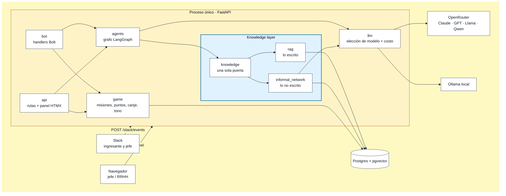
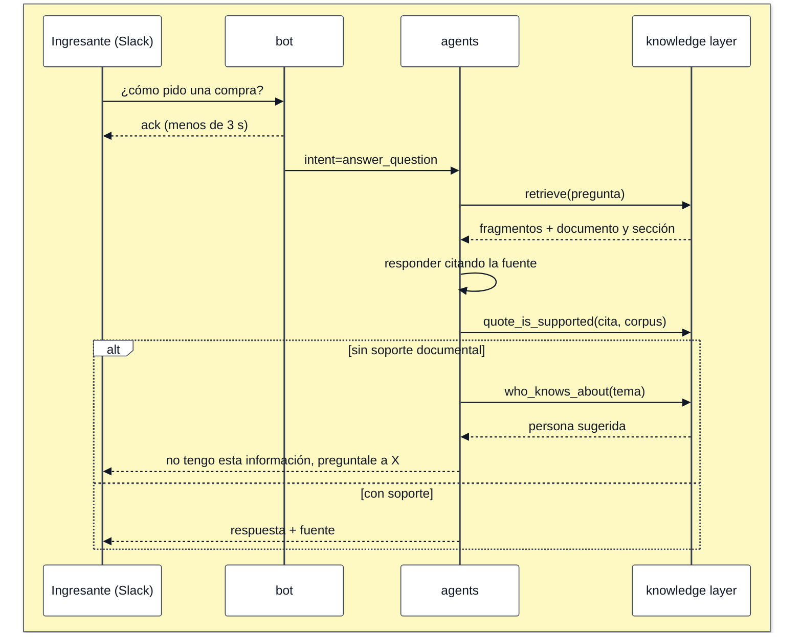

# Arquitectura

Documento vivo. Las decisiones puntuales y su motivo están en [adr/](adr/).

Vistas detalladas (módulos, orquestador, grafo de LangGraph, flujos, datos y
deploy): [diagramas.md](diagramas.md).

## Componentes

Un solo proceso sirve la API, el panel del jefe y el endpoint de Slack. Al lado,
una sola base: Postgres con pgvector guarda documentos, estado del juego y red
informal.

El corazón es la **knowledge layer**: una capa única con todo lo que la
organización sabe, lo escrito (`rag`) y lo no escrito (`informal_network`, quién
es quién más allá del organigrama). El sistema la construye y, por ahora, la usa
para el onboarding; el onboarding es la primera aplicación sobre la capa, no
parte de ella.

Reglas de dependencia:

- `bot` y `api` son **canales**: no tienen lógica de negocio, llaman a `game` y
  `agents`.
- `agents` orquesta. `game` y la knowledge layer no se importan entre sí.
- A la knowledge layer se entra solo por `onboarding.knowledge`. Adentro, `rag` e
  `informal_network` se pueden cruzar por clave.
- Nadie instancia un modelo por su cuenta: todo sale de `llm.get_chat_model()`.
- Cada módulo es dueño de sus tablas.

## Flujos

**Pregunta del ingresante**

**Misión completada**: evidencia → `agents` valida → el jefe aprueba con un clic
(Slack o panel) → `game` suma puntos → `agents` extrae conocimiento →
la red informal de la knowledge layer guarda las relaciones. Cada aprobación registra quién y cuándo:
esa es la métrica de horas-persona del TP.

## Ejecución

| Contenedor | Qué es | Local | Producción |
|---|---|---|---|
| `db` | `pgvector/pgvector:pg16` | sí (puerto 5433 en el host) | Neon |
| `migrate` | misma imagen, `alembic upgrade head` | sí | pre-deploy de Render |
| `app` | API + panel + `/slack/events` | sí, puerto 8000 con hot reload | único servicio web |
| `tunnel` | `cloudflared`, URL pública para Slack | perfil `tunnel` | no |
| `ollama` | modelo abierto para comparar | perfil `local-llm` | no |

Una sola imagen Docker con etapas `dev` y `prod`. Seed, ingesta y evaluación son
comandos puntuales sobre esa misma imagen.

## Modelos

`LLM_PROVIDER` elige de dónde sale el modelo y `LLM_MODEL` cuál es:

| Valor | Para qué |
|---|---|
| `fake` | Tests y CI: respuestas fijas, sin red, sin costo. Es el default |
| `openrouter` | Desarrollo y demo: una sola API key para Claude, GPT, Llama, Qwen |
| `openai_compat` | Modelo abierto self-host (Ollama) con la misma interfaz |

Comparar dos modelos es cambiar `LLM_MODEL` y volver a correr la evaluación, sin
tocar una línea de código. OpenRouter no ofrece embeddings: eso se resuelve
aparte en `knowledge/rag/embeddings.py` (ADR 0005).

Toda llamada queda registrada en `llm_calls` con tokens, latencia y propósito:
de ahí sale el costo por ingresante que promete la propuesta.

## Slack

Events API (HTTP), no Socket Mode: entra todo por `POST /slack/events` dentro de
la misma app, así producción es un solo contenedor. Slack corta a los 3 segundos,
así que los handlers hacen `ack()` inmediato y el trabajo pesado (RAG + modelo)
responde después. En desarrollo hace falta una URL pública: perfil `tunnel`.

## Deploy

Render (Web Service desde el Dockerfile, `render.yaml` versionado) + Neon
(Postgres con pgvector, persistente). Render despliega `main` cuando los checks
de CI pasan, corriendo antes `alembic upgrade head`.

## Fuera de alcance

Por decisión, no por olvido: Neo4j, Redis, multi-tenant, SSO, integración real
con plataformas de beneficios, multi-idioma y cualquier HRIS de producción.
