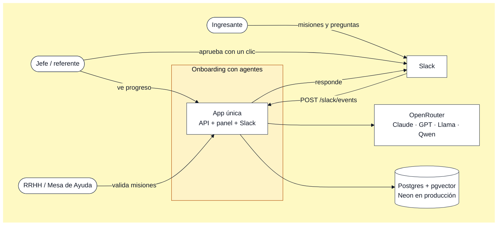
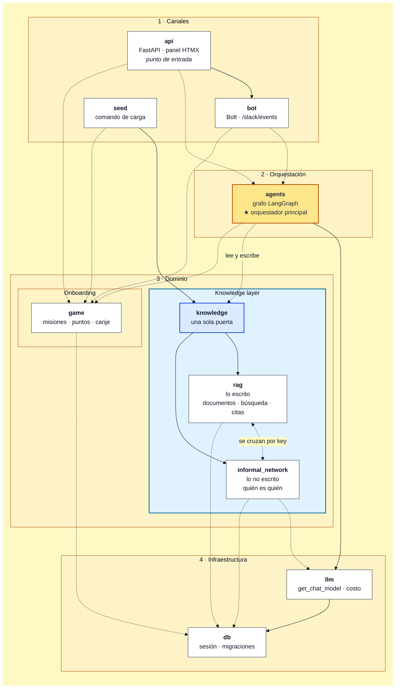
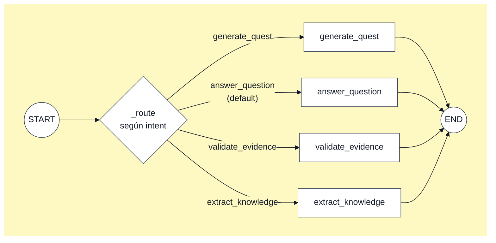
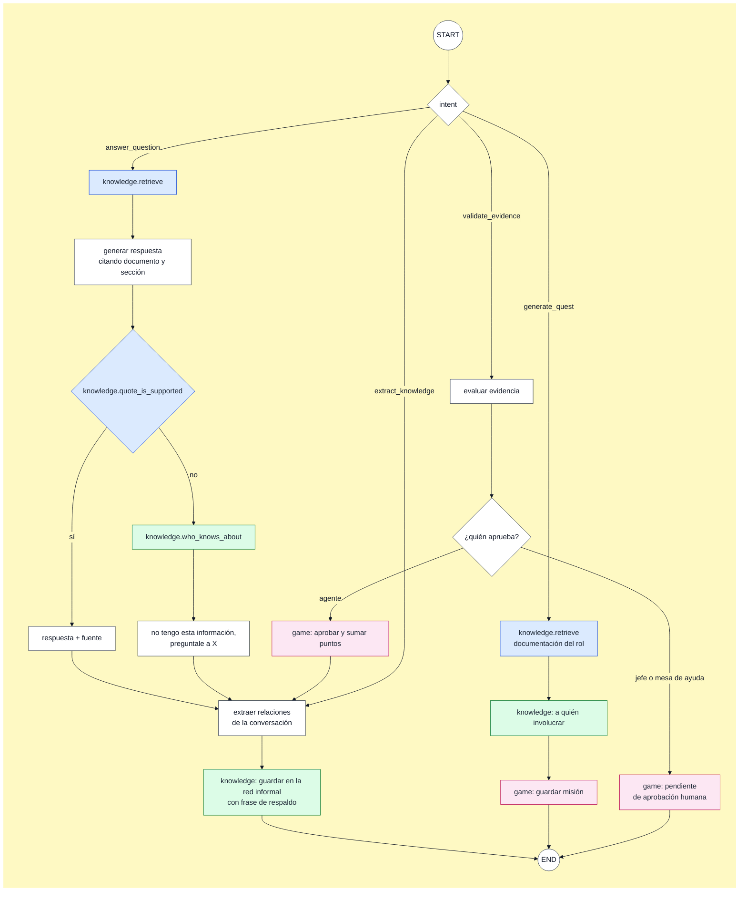
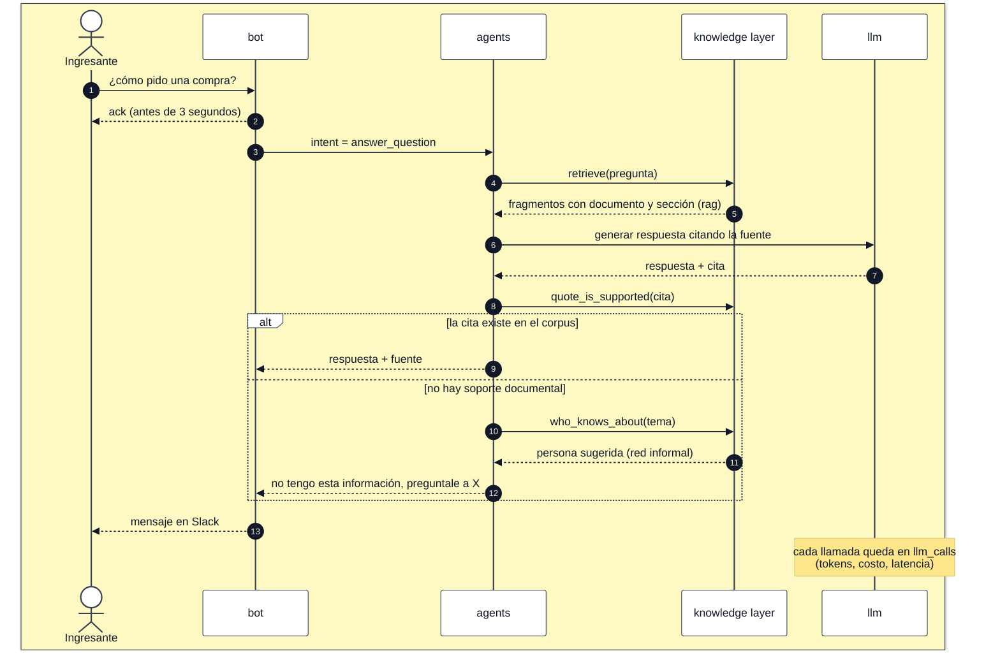
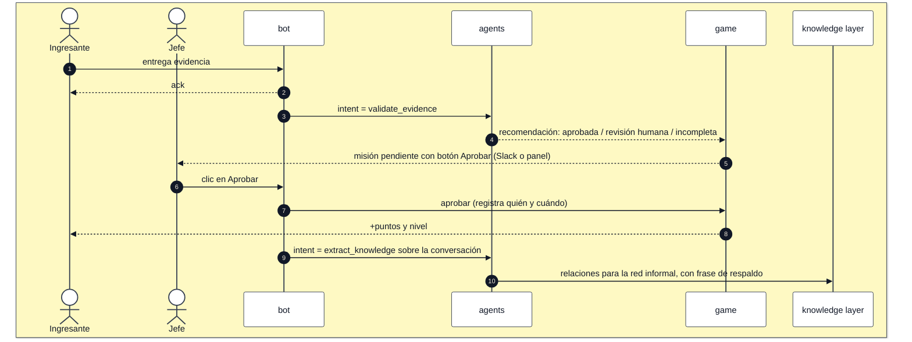
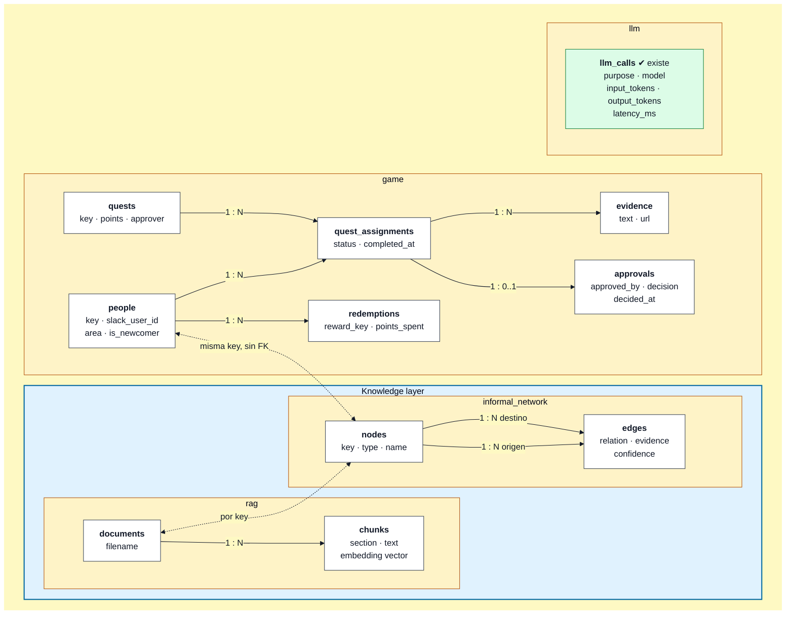
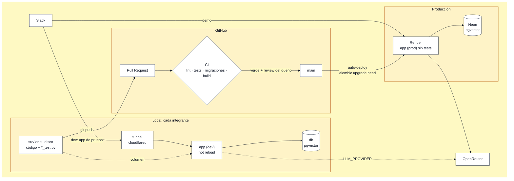

# Diagramas de arquitectura

Seis vistas, de lo general a lo particular.

Cómo verlos:

- **GitHub**: se dibujan solos.
- **VS Code**: extensión *Markdown Preview Mermaid Support*
  (`bierner.markdown-mermaid`) y `Ctrl+Shift+V`. Ver [setup.md](setup.md).
- **Para editarlos probando**: <https://mermaid.live>.

Convención en todos los diagramas:

- **Línea continua**: ya existe en el código.
- **Línea punteada**: diseñado, pendiente (`TODO(<rol>)`).

### Si agregás un diagrama

Todos tienen **fondo amarillo y líneas oscuras fijos**, para que se lean igual en
un editor claro o en uno oscuro. Para mantenerlo, copiá la estructura de uno
existente:

1. El bloque `%%{init: ...}%%` del principio: fija los colores de líneas y
   textos.
2. El fondo:
   - **flowchart**: todo adentro de `subgraph FONDO[" "]` con `direction` igual a
     la del diagrama, y al final
     `style FONDO fill:#fef9c3,stroke:#fef9c3`. Usá `TB` y no `TD`: dentro de un
     `subgraph`, Mermaid 11.12 (el de la extensión de VS Code) rechaza `TD`;
   - **sequenceDiagram**: los participantes adentro de `box rgb(254,249,195)` …
     `end`.

Títulos de recuadros (`subgraph`) **cortos**, de una o dos palabras: Mermaid
11.12 parte los largos en dos líneas y quedan encima de los nodos. El detalle va
en el texto debajo del diagrama.

No uses `erDiagram`, `classDiagram` ni otros tipos: Mermaid no les permite fondo
y en tema oscuro las líneas quedan invisibles. Las tablas se dibujan con
flowchart (ver el diagrama de datos). Tampoco sirve `themeCSS`: Mermaid 11
bloquea a propósito los estilos sobre el fondo.

---

## 1. Contexto: quién usa el sistema y con qué se conecta

---

## 2. Módulos y dependencias: quién orquesta

Las flechas van **siempre hacia abajo**: una capa solo conoce a las de debajo.

### La knowledge layer

Cada vez más empresas concentran todo lo que la organización sabe en una
**knowledge layer**: una capa única que cualquier aplicación puede consultar.
Este sistema la construye, por ahora restringida al onboarding.

Tiene dos fuentes y una sola puerta:

| Parte | Qué guarda | Titular |
|---|---|---|
| `knowledge.rag` | **Lo escrito**: manuales, políticas, procesos | RAG y evaluación |
| `knowledge.informal_network` | **Lo no escrito**: quién sabe de qué y a quién se consulta de verdad, lo que el organigrama no muestra | Grafo cultural y datos |
| `knowledge` | **La puerta**: lo único que el resto del sistema importa | los dos |

El onboarding (`game`, `bot`, `api`) no es parte de la capa: es **la primera
aplicación que la usa**. Lee de ella para responder y armar misiones, y escribe
en ella lo que extrae de cada conversación. Por eso la capa sirve más allá del
onboarding.

Para que se lea, quedan afuera dos dependencias que no aportan: `config`
(variables de entorno), que lo leen todos, y `api → db`, que se usa solo para
`/health/db`.

**Dos "orquestadores", dos responsabilidades:**

| Archivo | Rol | Qué decide |
|---|---|---|
| `api/main.py` → `create_app()` | **Punto de entrada** | Arma la aplicación: monta rutas, panel y Slack. No decide nada del negocio |
| `agents/graph.py` → `build_graph()` | **Orquestador principal** | Según la intención, qué pasos corren, en qué orden, y a qué módulos de dominio y a qué modelo llama |

Los canales (`api`, `bot`) reciben un pedido, se lo pasan a `agents` o a `game` y
devuelven la respuesta. Ninguno llama a la knowledge layer ni al modelo por su
cuenta.

**Reglas que el diagrama hace visibles:**

- Nada apunta hacia arriba: la knowledge layer no conoce a `agents`, `db` no
  conoce a `game`.
- `game` y la knowledge layer no se conectan entre sí: si uno necesita algo del
  otro, lo coordina `agents`.
- A la capa se entra **solo** por `knowledge` (`from onboarding.knowledge import
  retrieve`). Adentro, `rag` e `informal_network` sí se pueden cruzar (por
  ejemplo, un proceso documentado con la persona que de verdad lo maneja), por
  clave y sin foreign keys.
- Todo camino al modelo pasa por `llm`, que registra tokens y costo.

---

## 3. Adentro del orquestador: el grafo de LangGraph

### Hoy (`agents/graph.py`)

Cableado completo con nodos de prueba: cada intención llega a su nodo, que llama
al modelo con su prompt.

### Diseño objetivo

Lo que cada nodo tiene que hacer cuando se implemente. Colores: **azul**, lo
escrito (`rag`); **verde**, la red informal; **rosa**, `game`. Azul y verde son
la knowledge layer, a la que siempre se entra por `knowledge`.

Toda pregunta y toda aprobación terminan alimentando la red informal de la
knowledge layer: es el subproducto que diferencia la propuesta.

---

## 4. Flujos de punta a punta

### Pregunta del ingresante

### Misión completada y aprobación

El registro de quién aprobó y cuándo es la base de la métrica del TP:
horas-persona de la organización por ingresante.

---

## 5. Datos: qué tabla es de quién

| Tablas | Módulo dueño | Estado |
|---|---|---|
| `llm_calls` | `llm` (Plataforma) | **existe** (migración 0002) |
| `people`, `quests`, `quest_assignments`, `evidence`, `approvals`, `redemptions` | `game` (Experiencia) | diseñadas |
| `nodes`, `edges` | `knowledge.informal_network` (Grafo cultural) | diseñadas |
| `documents`, `chunks` | `knowledge.rag` (RAG) | diseñadas; la dimensión del vector espera el ADR 0005 |

**No hay claves foráneas entre módulos.** Una persona de `game` y su nodo en la
red informal se relacionan por la misma `key`, no por FK; lo mismo un documento
con el tema o proceso que describe. Así cada módulo migra
sus tablas sin depender de otro, y cambiar el motor de uno (por ejemplo, el grafo
a Neo4j) no arrastra a los demás.

---

## 6. Ejecución y camino a producción

En desarrollo y en CI el modelo por defecto es `fake`: no hay llamadas a
OpenRouter hasta que alguien lo configure en su `.env`.
